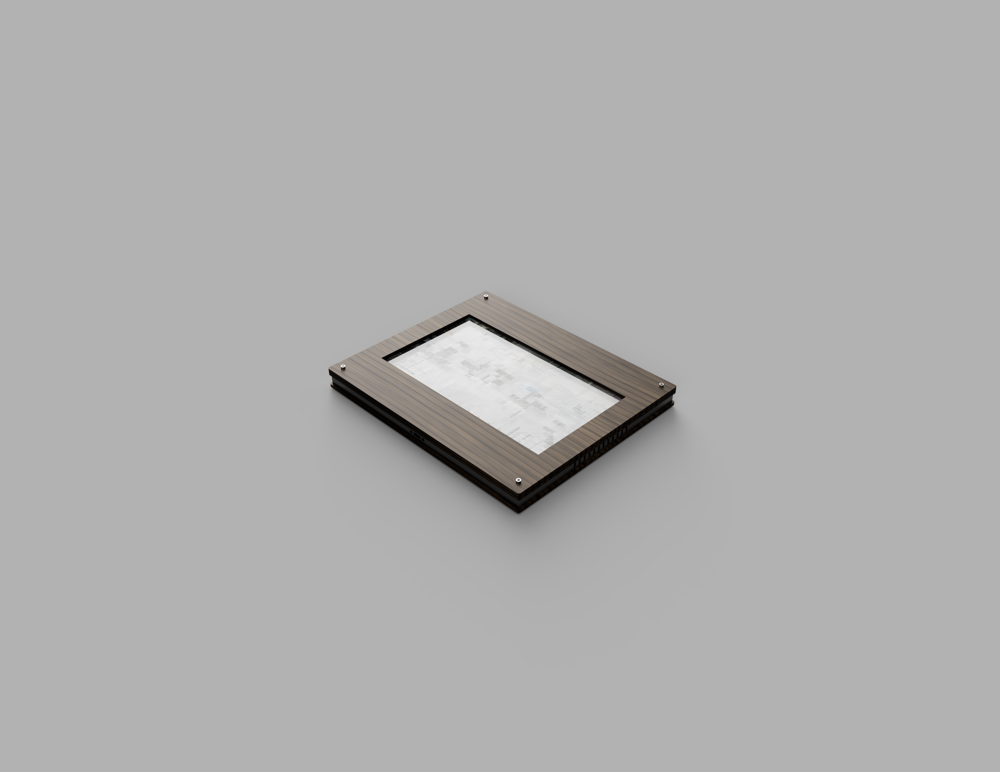

# Elsewhere

Raspberry Pi based picture frame intended for displaying livestreams.



## Parts

- [Raspberry Pi Zero W](https://www.adafruit.com/product/3400)
- [Pimoroni HDMI 10" IPS LCD Screen Kit](https://www.adafruit.com/product/4337)
- [Antrader 200pcs Picture Frame Hanging Clips S Hooks Back Board Photo Wall Album Artwork Sawtooth Hanger for 2-4mm Board](https://www.amazon.com/gp/product/B07GLCXVZZ/)
- [JXMOX USB C to Micro USB Adapter, (4-Pack) Type C Female to Micro USB Male Convert Connector Support Charge & Data Sync Compatible with Samsung Galaxy S7/S7 Edge, Nexus 5/6 and Micro USB Devices(Grey)](https://www.amazon.com/gp/product/B07GH5KJH2/)
- [Electop Micro USB Female to 2 Micro USB Male Splitter Cable](https://www.amazon.com/gp/product/B017OPOG58/)
- [Cablecc USB-C USB 3.1 Type C Male to Female Extension Data Cable Panel Mount](https://www.ebay.com/itm/143134180140)
- [DIY USB or HDMI Cable Parts - 30 cm Ribbon Cable](https://www.adafruit.com/product/3562)
- [DIY HDMI Cable Parts - Straight HDMI Plug Adapter](https://www.adafruit.com/product/3548)
- [DIY HDMI Cable Parts - Straight Mini HDMI Plug Adapter](https://www.adafruit.com/product/3552)

## Installation

```bash
git clone git@github.com:jbmorley/elsewhere.git
cd elsewhere
python3 setup.py
```

