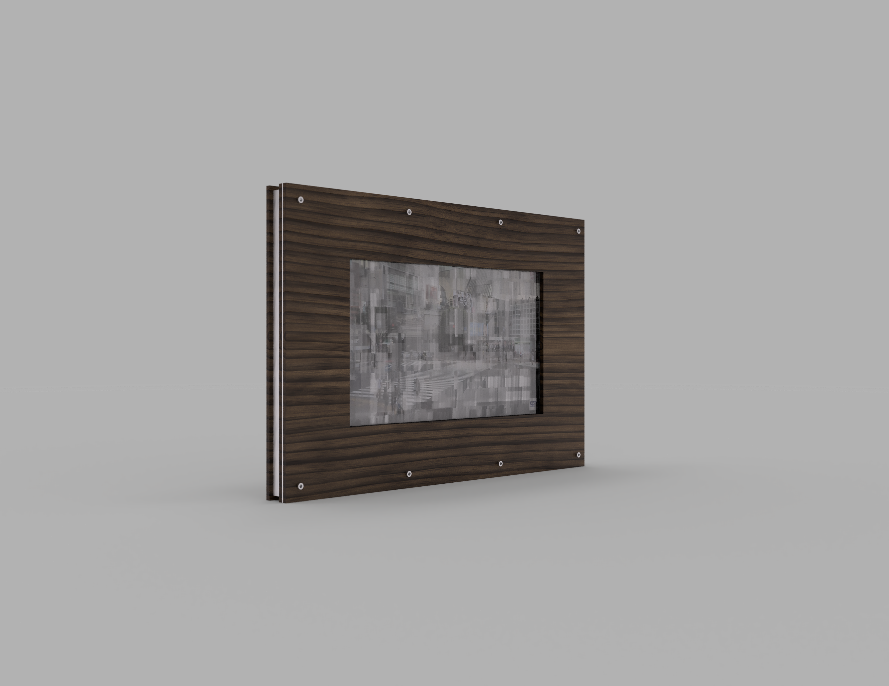
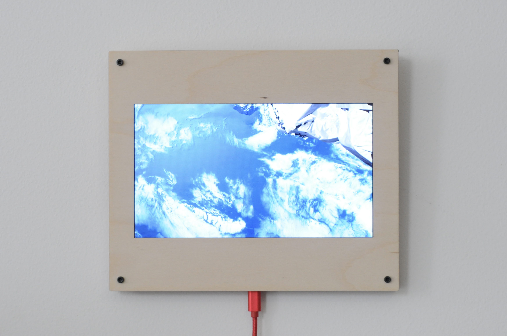

# Elsewhere

Raspberry Pi based picture frame for displaying livestreams.



## Parts

| **Part**                                  | **Link**                                                     | Quantity | **Unit Price**            | **Price**   |
| ----------------------------------------- | ------------------------------------------------------------ | -------- | ------------------------- | ----------- |
| **Raspberry Pi Zero W**                   | [Adafruit](https://www.adafruit.com/product/3400)            | 1        | $10.00                    | $10.00      |
| **Pimoroni HDMI 10" IPS LCD Screen Kit**  | [Adafruit](https://www.adafruit.com/product/4337)            | 1        | $139.95                   | $139.95     |
| HDMI Ribbon Cable, 30 cm                  | [Adafruit](https://www.adafruit.com/product/3562)            | 1        | $2.75                     | $2.75       |
| HDMI Plug Adapter                         | [Adafruit](https://www.adafruit.com/product/3548)            | 1        | $6.50                     | $6.50       |
| Mini HDMI Plug Adapter                    | [Adafruit](https://www.adafruit.com/product/3552)            | 1        | $6.50                     | $6.50       |
| **ATXRaspi R3**                           | [LowPowerLab](https://lowpowerlab.com/shop/product/91)       | 1        | $17.95                    | $17.95      |
| USB Type-A Female Connector               | [LowPowerLab](https://lowpowerlab.com/shop/product/91)       | 1        | $2.00                     | $2.00       |
| USB A to Micro B Cable, 6"                | [LowPowerLab](https://lowpowerlab.com/shop/product/91)       | 1        | $4.00                     | $4.00       |
| D-Ring Picture Hanger, M4                 |                                                              | 2        |                           |             |
| USB-C Panel Mount                         | [eBay](https://www.ebay.com/itm/143134180140)                | 1        | $6.29                     | $6.29       |
| USB-C to Micro USB Adapter                | [Amazon](https://www.amazon.com/gp/product/B07GH5KJH2/)      | 1        | $6.99                     | $6.99       |
| Micro USB Splitter Cable                  | [Amazon](https://www.amazon.com/gp/product/B017OPOG58/)      | 1        | $6.79                     | $6.79       |
| microSD Card, 32GB                        | [Amazon](https://www.amazon.com/SAMSUNG-Select-microSDXC-Adapter-MB-ME128HA/dp/B06XWN9Q99) | 1        | $7.99                     | $7.99       |
| M3 Standoff, 10mm                         | [McMaster-Carr](https://www.mcmaster.com/94868A166/)         | 8        | $1.24                     | $9.92       |
| 4-40 Socket Head Screw, Low-Profile, 1/4" | [McMaster-Carr](https://www.mcmaster.com/93615A110/)         | 2        | $1.55 (Pack of 10)        | $3.10       |
| M3 Socket Head Screw, Low-Profile, 12mm   | [McMaster-Carr](https://www.mcmaster.com/92855A313/)         | 8        | $0.11 (Pack of 25)        | $0.22       |
| M3 Socket Head Screw, Low-Profile, 6mm    | [McMaster-Carr](https://www.mcmaster.com/92855A307/)         | 8        | $0.30 (Pack of 25)        | $0.60       |
| M2.5 Socket Head Screw, 6mm               | [McMaster-Carr](https://www.mcmaster.com/91292A010/)         | 28       | $0.06 ($6.00 Pack of 100) | $1.68       |
| M2.5 Standoff, 6mm                        | [Digi-Key](https://www.digikey.com/en/products/detail/970060154/732-12827-ND/9488531) | 14       | $0.34 ($16.95 Pack of 50) | $4.76       |
|                                           |                                                              |          |                           | **$237.99** |

## Installation

1. Install Rasbian.

2. Update Raspbian:

   ```bash
   sudo apt update
   sudo apt upgrade --yes
   ```

3. Install useful packages:

   ```bash
   sudo apt install --yes \
       emacs \
       git \
       streamlink \
       mosh \
       python3-bs4 \
       python3-flask \
       python3-gpiozero \
       python3-pip \
       python3-pycparser
   ```

4.   Clone the repository:

   ```bash
   mkdir -p ~/projects
   cd ~/projects
   git clone https://github.com/jbmorley/elsewhere.git
   cd elsewhere
   python3 setup.py
   ```

To run Elsewhere on startup, add the following to your crontab:

```
@reboot /usr/bin/python3 /home/pi/projects/elsewhere/elsewhere.py /home/pi/projects/elsewhere/urls.txt
```

## Configuration

- **Device Orientation**

  To change the orientation of your device, add `display_rotate=2` to `/boot/config.txt` and reboot.0

## Builds

Elsewhere is an iterative project, meaning I've put together a number of prototypes along the way. The most recent one still has the 4:3 aspect ratio, and has been happily showing us views from the ISS for the last few months.


